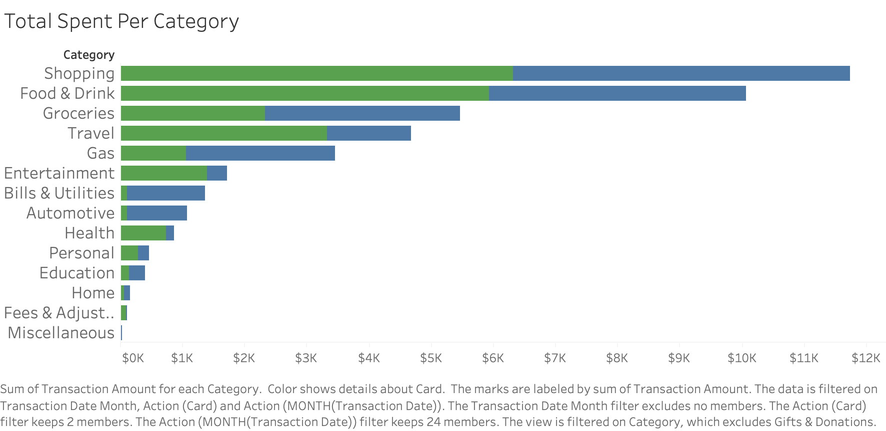

# Credit Card Spending Analysis

The purpose of this project is to analyze my credit card spending with my two main credit cards to identify GAPs in my spending trends and maxamize the points I earn. I utilize my real credit card transaction history and data analysis skills to enhance my daily life.

---
## 2. Data Overview

The data I gathered was exported from my Chase Portal. The following is features of the data set.
- Time period
  - 2024-2025
- Total trnasactions
  - 1378 transactions
- Total Spent
  - $42,464
- Fields

| Feild | Description |
| ----- | ----- |
| Transaction Date | The date the transaction occurred |
| Post Date | The date the bank processes the transaction |
| Description | Vendor name or store location |
| Category | Food & Drink, Shopping, ... |
| Type | Sale, Payment, ... |
| Amount | Transaction amount |
| Card | Freedom or Sapphire |
| Merchant | Target, MTA, REI |

- Categories

| Category    | Transaction Count |
| -------- | ------- |
| Food & Drink | 459 |
| Shopping | 316 |
| Grocies | 229 |
| Gas | 84 |
| Travel | 80 |
| Bills & Utilities | 58 |
| Entertainment | 30 |
| Fees & Adj. | 26 |
| Health | 18 |
| Education | 17 |
| Automotive | 15 |
| Personal | 11 |
| Home | 5 |
| Misc. | 2 |
- Cleaning
  - Combined both the Chase Freedom & Chase Sapphire Preferred data sets
  - Created a "Card" column to indicate wich card the transaction originated from
  - Changed the transactions from negative to positive for better analysis
  - Added a merchant field by matching the description against a dictionary of commonly used merchants
## 5. Card Bonus Breakdown

| Category | Chase Sapphire Preferred | Chase Freedom Unlimited |
| ---- | ---- | ---- |
| Dining (restaurants, takeout, delivery) |	3× points |	3× points
| Travel (general) | 2× points |	**5× points via Chase Travel** |
| Travel booked through Chase Travel |	5× points	| 5× points |
| Groceries (online, excluding Target/Walmart) |	**3× points** |	— |
| Drugstores |	—	| **3× points** |
| All other purchases |	1× point	| **1.5× points** |
| Annual travel credit |	**$50 (hotel bookings via Chase Travel)** |	— |
| Points value when redeemed for travel |	**1.25¢ per point**	| 1¢ per point
| Transfer points to airline/hotel partners	| **Yes** |	No |

**Strategy**
- Use the Freedom Unlimited for everyday purchases, groceries, Gas, etc
- Use the Chase Sapphire Preferred for food delivery and travel (there are also no conversion fees)
 
## 4. Current Spending Breakdown

### Dashboard 

I created four visuals for the dashboard to give myself a quick overview of my spending habits and identify areas where I'm not maximizing my credit points.

1. Spend by category (**Bar Chart**)
2. Total Spent (**Bar Chart**)
3. Monthly total spent (**Line Graph**)
4. Number of Purchases (**Bar Graph**)

### Total Spent Per Category

- I created a stacked bar chart with a color mark to visualize the difference between **Freedom** (Blue) and **Sapphire** (Green). 

### Monthly Total Spent

- I created a line chart to visualize spending over time.
- Useful for identifying trends in spending and to help see if the strategy is improving over time.

## 5. Dashboard Analysis
- Work In Progress.

