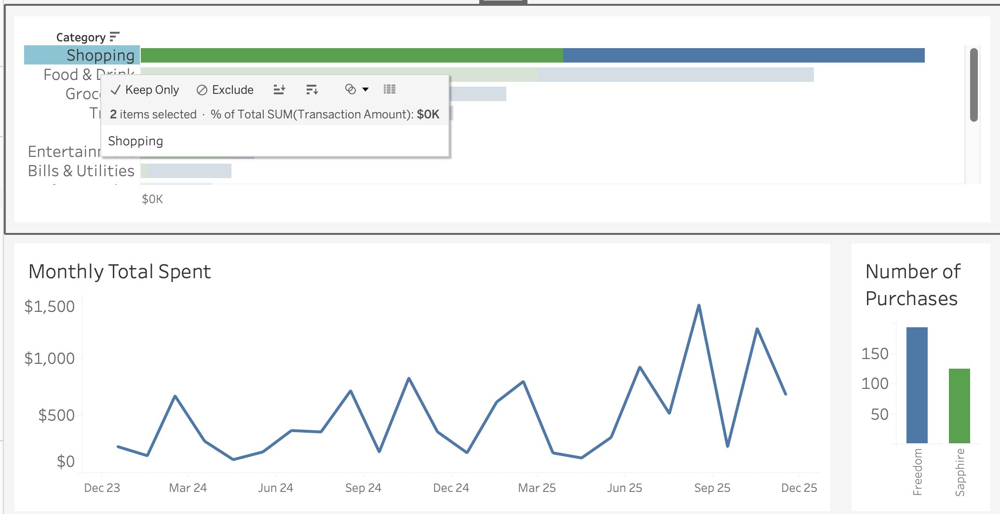
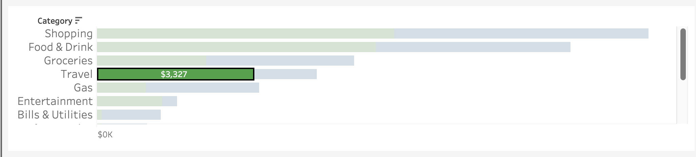

# Credit Card Spending Analysis

This project analyzes two years of personal credit card transaction data (1,378 transactions totaling $42,464) to identify inefficiencies in reward point optimization between the Chase Sapphire Preferred and Chase Freedom Unlimited cards. The goal is to quantify missed reward opportunities and design a data-driven allocation strategy to maximize long-term point value.

---
## 2. Data Overview

The data I gathered was exported from my Chase Portal. The following are features of the data set.

- Time period
  - 2024-2025
- Total transactions
  - 1378 transactions
- Total Spent
  - $42,464
- Fields

| Field | Description |
| ----- | ----- |
| Transaction Date | The date the transaction occurred |
| Post Date | The date the bank processes the transaction |
| Description | Vendor name or store location |
| Category | Food & Drink, Shopping, ... |
| Type | Sale, Payment, ... |
| Amount | Transaction amount |
| Card | Freedom or Sapphire |
| Merchant | Target, MTA, REI |

- Categories

| Category    | Transaction Count |
| -------- | ------- |
| Food & Drink | 459 |
| Shopping | 316 |
| Groceries | 229 |
| Gas | 84 |
| Travel | 80 |
| Bills & Utilities | 58 |
| Entertainment | 30 |
| Fees & Adj. | 26 |
| Health | 18 |
| Education | 17 |
| Automotive | 15 |
| Personal | 11 |
| Home | 5 |
| Misc. | 2 |
- Cleaning
  - Combined both the Chase Freedom & Chase Sapphire Preferred data sets
  - Created a "Card" column to indicate which card the transaction originated from
  - Changed the transactions from negative to positive for better analysis
  - Added a merchant field by matching the description against a dictionary of commonly used merchants
    
## 5. Card Bonus Breakdown

| Category | Chase Sapphire Preferred | Chase Freedom Unlimited |
| ---- | ---- | ---- |
| Dining (restaurants, takeout, delivery) |	3× points |	3× points
| Travel (general) | 2× points |	**5× points via Chase Travel** |
| Travel booked through Chase Travel |	5× points	| 5× points |
| Groceries (online, excluding Target/Walmart) |	**3× points** |	— |
| Drugstores |	—	| **3× points** |
| All other purchases |	1× point	| **1.5× points** |
| Annual travel credit |	**$50 (hotel bookings via Chase Travel)** |	— |
| Points value when redeemed for travel |	**1.25¢ per point**	| 1¢ per point
| Transfer points to airline/hotel partners	| **Yes** |	No |
| 75,000 points bonus 	| Spend $5k in first 3 months |	No |

**Strategy**
- Use the Freedom Unlimited for everyday purchases, groceries, Gas, etc. (everything that isn't a bonus for the Sapphire card)
- Use the Chase Sapphire Preferred for food delivery and travel (there are also no conversion fees)
 
## 4. Current Spending Breakdown

### Dashboard 

I created four visuals for the dashboard to give myself a quick overview of my spending habits and identify areas where I'm not maximizing my credit points.

1. Spend by category (**Bar Chart**)
2. Total Spent (**Bar Chart**)
3. Monthly total spent (**Line Graph**)
4. Number of Purchases (**Bar Graph**)

### Total Spent Per Category

- I created a stacked bar chart with a color mark to visualize the difference between **Freedom** (Blue) and **Sapphire** (Green). 

### Monthly Total Spent

- I created a line chart to visualize spending over time.
- Useful for identifying trends in spending and to help see if the strategy is improving over time.

## 5. Credit Points Dashboard Analysis

### Shopping Strategy 

- Shopping category is nearly 50/50, but is still mostly used by the Sapphire card. The Freedom card earns 1.5x points on all purchases, while the Sapphire does not receive a bonus. I have left approximately 3,163 points on the table by not using the correct card.

### Travel Strategy

- Travel points rewards are 2x for the Sapphire preferred, while the Freedom card only receives the same 5x bonus on the Chase travel portal. I traveled a lot in 2025, and I definitely executed this strategy correctly by spending nearly 2/3rds of the travel category on the Sapphire card.

## Points Strategy Performance Summary

Overall, the analysis indicates moderate efficiency in my credit card allocation strategy. While travel spending was largely optimized by using the Sapphire Preferred (which earns elevated rewards and has no foreign transaction fees), a meaningful portion of general purchases were incorrectly placed on the Sapphire instead of the Freedom Unlimited.

Because the Freedom Unlimited earns 1.5× points on non-bonus purchases compared to 1× on the Sapphire, this misallocation reduced overall reward efficiency. The largest opportunity for improvement lies in reallocating everyday, non-bonus spending to the Freedom card.

Additionally, the analysis does not fully quantify the benefit of avoiding foreign transaction fees. During international travel to Mexico and Spain in 2025, using the Sapphire likely generated savings beyond point optimization due to its 0% foreign transaction fee structure. Incorporating location-based analysis could further refine the model.

